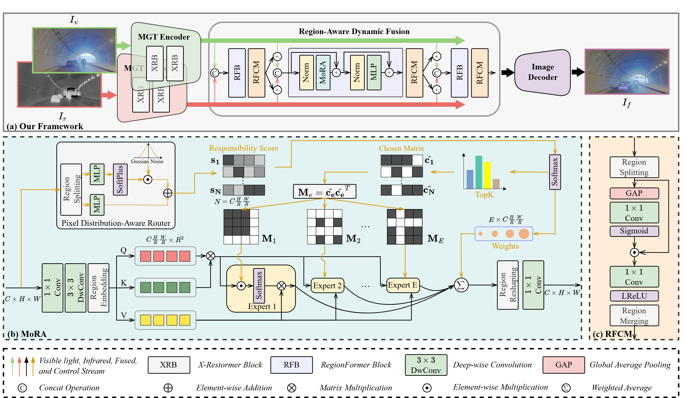

# RegionFuse
Official repository for the paper ***"RegionFuse: Region-Adaptive Pixel Distribution Learning for Infrared and Visible Image Fusion"(CVPR 2026).***

Jianghan Xia$^1$, Hong Song$^{1*}$, Jinfu Li$^{1*}$, Yucong Lin$^{2}$, Shihan Ma$^{1}$, Jingfan Fan$^{2}$ Danni Ai$^{2}$, Tianyu Fu$^{2}$, Deqiang Xiao$^{2}$, Jian Yang$^{2*}$

$^1$the School of Computer Science and Technology, Beijing Institute of Technology

$^2$the School of Optics and Photonics, Beijing Institute of Technology

\*Corresponding authors: Hong Song (songhong@bit.edu.cn), Jinfu Li (jinfuli@bit.edu.cn), Jian Yang (jyang@bit.edu.cn).

---
>Infrared and Visible Image Fusion (IVIF) aims to combine complementary information from infrared and visible images to overcome the limitations of a single modality. While existing methods typically employ fixed or sample-adaptive fusion paradigms where fusion weights are static or derived from global pixel distributions, they often overlook spatial inconsistencies in pixel distribution within images, leading to suboptimal performance. To address this issue, we propose RegionFuse, a Region-Adaptive Pixel Distribution Learning Network for IVIF, which dynamically generates fusion weights based on local pixel distributions to construct a region-wise adaptive fusion paradigm. RegionFuse introduces a Mixture of Region Attention (MoRA) mechanism, which assigns each region to several specialized experts, enabling region-level feature interaction tailored to specific local distributions. Furthermore, we design a Region Feature Compression Module (RFCM) and place it after each MoRA to enhance informative regions and suppress redundant ones. Extensive experiments on various benchmarks demonstrate the superiority and robustness of RegionFuse, especially in handling non-uniform pixel distributions. Evaluations on NIR-VIS and downstream tasks further confirm its generalizability and practical utility.
---

## Status
Code will be released soon.
